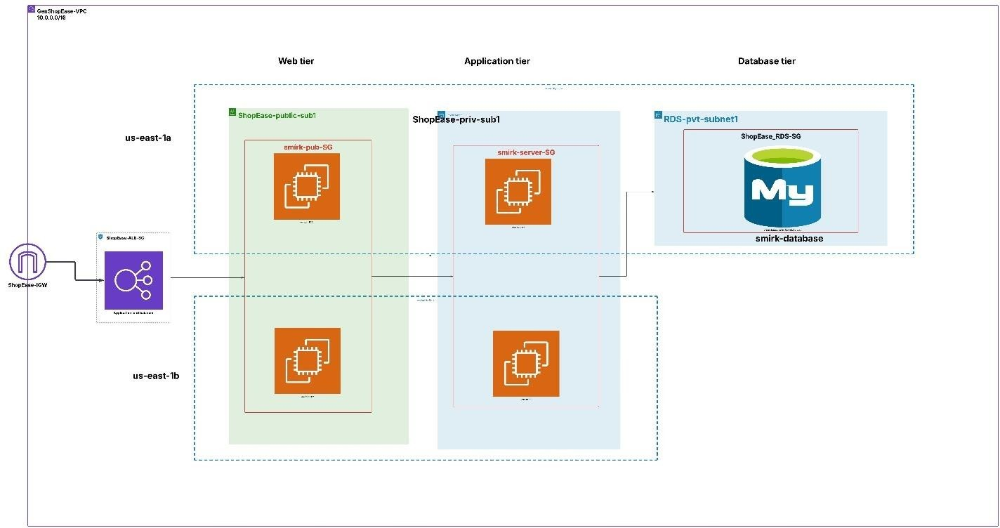

# 🚀 Secure and Scalable AWS Infrastructure Project

## 1️⃣ Introduction

This project focuses on designing and deploying a **secure, scalable, and highly available infrastructure** on Amazon Web Services (AWS) using core cloud services.  

The primary objectives include implementing auto-scaling and load balancing for optimized performance, enforcing security best practices within a Virtual Private Cloud (VPC), and establishing reliable monitoring and logging mechanisms.  

Key AWS services such as **EC2**, **RDS**, **ALB**, **CloudWatch**, and **IAM** are integrated to demonstrate a robust architecture that aligns with cloud best practices. The result is a reliable environment capable of handling dynamic workloads with minimal latency and maximum uptime.

---

## 2️⃣ Project Objectives

- **Design and Deploy a VPC**  
  Create a secure VPC architecture with dedicated public and private subnets for different application tiers.

- **Implement Auto Scaling and Load Balancing**  
  Configure auto-scaling groups to manage fluctuating loads and set up load balancers for high availability.

- **Secure the VPC**  
  Enforce best practices using network ACLs, security groups, and proper IAM roles.

- **Logging and Monitoring**  
  Implement monitoring and logging solutions to track application performance and infrastructure health.

---

## 3️⃣ Cloud Platform Selection

For this project, **Amazon Web Services (AWS)** was chosen for its scalability, reliability, cost-effectiveness, and extensive service ecosystem. All infrastructure components were deployed and managed within AWS.

---

## 4️⃣ VPC Architecture Design

A custom Virtual Private Cloud (VPC) was designed with two Availability Zones (AZs), each containing:

- **2 Public Subnets**: For internet-facing resources like the Application Load Balancer (ALB) and NAT Gateway.
- **2 Private Subnets**: For internal resources like Amazon RDS and application servers.

This design supports high availability and fault tolerance.

---

## 5️⃣ Network Security

- Configured **Security Groups** to allow only necessary inbound/outbound traffic per role.
- Implemented **Network ACLs** (NACLs) at subnet level for additional stateless filtering.
- Followed **least privilege principle** to minimize attack surface.

---

## 6️⃣ Load Balancer and Auto Scaling

- Deployed an **Application Load Balancer (ALB)** in public subnets to distribute HTTP/S traffic across instances.
- Configured **Auto Scaling Groups (ASG)** to dynamically add or remove EC2 instances based on metrics like CPU utilization and request count.

---

## 7️⃣ Database Deployment

- Deployed an **Amazon RDS (MySQL)** instance within private subnets to avoid public exposure.
- Used IAM instance roles (`AmazonEC2RoleforSSM`) for secure administrative access via Systems Manager Session Manager.
- Configured a NAT Gateway in public subnet to allow EC2 instances in private subnets to access AWS services without direct internet exposure.

---

## 8️⃣ Monitoring and Logging

- Integrated **Amazon CloudWatch** for:
  - Monitoring key metrics
  - Custom alarms
  - Centralized log collection from EC2 instances

This setup supports proactive troubleshooting and performance tracking.

---

## 9️⃣ Static Website Deployment

A static e-commerce website frontend was deployed using **AWS Amplify**.

- Website files (HTML, CSS, JS) stored in an S3 bucket.
- Amplify connected to a GitHub repository for automated deployments.

---

## 🔟 Architecture Diagram

```




```
## Key Components Represented in the Architecture Diagram:

```
➢ VPC and Subnet Layout
The design features a custom Virtual Private Cloud (VPC) segmented into:
```
- Two Public Subnets **(across separate Availability Zones) for internet-facing resources such**
    **as the Application Load Balancer (ALB) and NAT Gateway.**
- Two Private Subnets (also in separate Availability Zones) for backend resources, in-
    cluding EC2 instances in an Auto Scaling group and an Amazon RDS database.
➢ Application Load Balancer (ALB)
Placed in the public subnets, the ALB serves as the single-entry point for incoming
HTTP/S traffic. It intelligently routes requests to healthy instances across availability
zones, ensuring load distribution and fault tolerance.
➢ Auto Scaling Group (ASG) with EC2 Instances
Hosted in the private subnets, the ASG dynamically manages the number of EC2 in-
stances based on traffic load, ensuring optimal performance and cost-efficiency.
➢ Amazon RDS (MySQL)
Deployed in one of the private subnets, the managed database is isolated from public in-
ternet access for enhanced security, while maintaining connectivity to the EC2 instances
via private networking.
➢ Security Layers
The diagram highlights the use of:
- Security Groups for fine-grained access control between components
- NACLs for stateless traffic filtering at the subnet level
➢ NAT Gateway
Positioned in a public subnet, the NAT Gateway enables outbound internet access for in-
stances in the private subnets without exposing them to direct incoming traffic.
➢ Session Manager Access (via IAM Role)
The architecture includes IAM roles that enable Session Manager functionality, providing
secure shell-less access to private EC2 instances without requiring a bastion host or pub-
lic IP.
➢ Monitoring via CloudWatch
Integrated throughout the architecture, Amazon CloudWatch aggregates metrics, logs,
and events for continuous monitoring, troubleshooting.
➢ Static Website Hosting with Amplify
In parallel with the backend infrastructure, AWS Amplify hosts a static e-commerce
frontend, ensuring a decoupled, responsive, and scalable user interface.


12. Implementation Steps

The following steps outline the systematic deployment and configuration of the AWS
infrastructure components, ensuring a secure, scalable, and production-ready cloud environment.

## 12. 1 VPC and Subnet Configuration

- Created a custom VPC with a CIDR block of 10.0.0.0/16.
- Created two public subnets (e.g., 10.0.1.0/24, 10.0.2.0/24) and two private subnets
    (e.g., 10.0.3.0/24, 10.0.4.0/24), distributed across two Availability Zones for high availa-
    bility.
- Associated appropriate route tables and internet gateway to enable internet access for
    public subnets.
- Attached NAT Gateway to public subnet for controlled outbound internet access from
    private subnets.


```
Fig.2 VPC with Subnet Layout in AWS Console
```
## 1 2. 2 Security Configuration

- Created Security Groups:
    o ALB SG to allow inbound HTTP/HTTPS traffic from the internet.
    o EC2 SG to allow only traffic from ALB.
    o RDS SG to allow access from EC2 security group only.
- Configured NACLs:
    o Public subnets: allow inbound HTTP/HTTPS and SSH.
    o Private subnets: allow internal application traffic and DB access.


```
Fig.3 Security Group and NACL Rules Overview
```
## 12. 3 Launch and Configure EC2 Instances

- Created an EC2 launch template with Amazon Linux 2 AMI and essential bootstrap
    scripts.
- Set up an Auto Scaling Group (ASG) using the launch template and spread instances
    across private subnets.
- Attached the IAM role with AmazonEC2RoleforSSM to support Systems Manager ac-
    cess.


```
Fig. 4 Launch Template and Auto Scaling Group Configuration
```
## 12. 4 Setup of Application Load Balancer (ALB)

- Deployed an Application Load Balancer in public subnets with listeners on port 80
    (HTTP).
- Registered EC2 instances from the ASG as targets in a target group for load distribu-
    tion.
- Configured health checks to monitor instance responsiveness.


```
Fig.5 ALB and Target Group Configuration
```
## 12. 5 Database Setup using Amazon RDS

- Launched a MySQL RDS instance in a private subnet with “Single-AZ” deployment.
- Configured security groups and parameter groups.
- Disabled public accessibility.
- Connected EC2 instances to RDS via private IP and verified connectivity through Sys-
    tems Manager Session Manager.


```
Fig. 6 RDS Instance Details and Connectivity Test via Session Manager
```
## 12. 6 Systems Manager and IAM Configuration

- Attached AmazonSSMManagedInstanceCore policy to EC2 role.
- Verified secure access to EC2 instances via Session Manager (no public IP needed).


```
Fig.7 Session Manager Console Showing Active Session
```
## 12. 7 Monitoring and Alerts with CloudWatch

- Set up CloudWatch Alarms for:
    o EC2 CPU Utilization
    o ALB request count and health status
- Enabled CloudWatch Logs to collect application and system logs.

```
Fig.8 CloudWatch Dashboard with Key Metrics
```
## 12. 8 Static Website Deployment with AWS Amplify

- Connected GitHub repository to AWS Amplify Console.


- Deployed a React-based e-commerce frontend as a static website.

```
Fig. 9 Amplify App Build and Deployment Screen
```
13. Challenges & Resolutions

During the design and implementation phases of the project, several technical and configuration-
related challenges arose. These provided valuable learning opportunities and insights into cloud
infrastructure troubleshooting. Below are the key challenges faced and how they were resolved:

## 13. 1 RDS Connectivity Failure from EC2 Instances in Private Subnet

Challenge:
An error message (ERROR 2002 (HY000): Can't connect to MySQL server...) was encountered
when trying to connect from EC2 to the RDS database using the private endpoint and port 3306.

Root Cause:
The security group attached to the RDS instance was not permitting inbound MySQL (port 3306)
traffic from the EC2 instances.

Resolution:
The RDS security group was updated to allow inbound traffic from the EC2 instance security
group on port 3306. After the change, connectivity was successful.

## 13. 2 Systems Manager Session Manager Access Failure

Challenge:
When attempting to connect to private EC2 instances via Session Manager, an error was


displayed:
**_“The version of SSM Agent on the instance supports Session Manager, but the instance is not_**
configure **_d for use with AWS Systems Manager.”_**

Root Cause:
The EC2 instance did not have the correct IAM instance profile, and the required policy for SSM
were not configured.

Resolution:

- Attached an IAM role with the AmazonSSMManagedInstanceCore policy to the EC2 in-
    stance.
- Ensured the EC2 instance had outbound internet access via the NAT Gateway.
- Once these were in place, Session Manager access was restored.
-

## 13. 31 EC2 Instances Marked as Unhealthy and Draining by Load Balancer

Challenge:
After deploying the Auto Scaling Group and registering EC2 instances with the Application
Load Balancer (ALB), the instances were marked as _“unhealthy”_ and entered a _“draining”_
state. This prevented the load balancer from routing traffic, despite the instances running and
accessible internally.

Root Cause:
The health check path configured in the ALB did not correspond to any accessible route on the
EC2 instances. By default, ALB health checks were targeting /, but the application on the
instances did not have a web server or listener responding on that path or port.

Resolution:

- Verified the correct target group protocol and port (HTTP on port 80).
- Installed and started a basic web server (Apache)
- Ensured that security groups allowed inbound traffic from the ALB security group.
- Once aligned, the instances passed the health checks and entered the **_“InService”_** state.

1 4.Conclusion & Recommendations

This project successfully demonstrated the end-to-end design and deployment of a highly
available, scalable, and secure cloud infrastructure using Amazon Web Services (AWS). By
building a custom VPC with public and private subnets, implementing an Application Load
Balancer, configuring Auto Scaling Groups, and deploying a managed database with Amazon
RDS, the environment meets both performance and security standards suitable for modern cloud-
native applications.

Key AWS services such as EC2, RDS, IAM, SSM, CloudWatch, and Amplify were leveraged
to create a resilient, cost-efficient infrastructure.


Real world troubleshooting scenarios such as instance health check failures, connectivity
problems, and Systems Manager configuration issues were effectively resolved, leading to
improved system reliability and overall operational efficiency.


